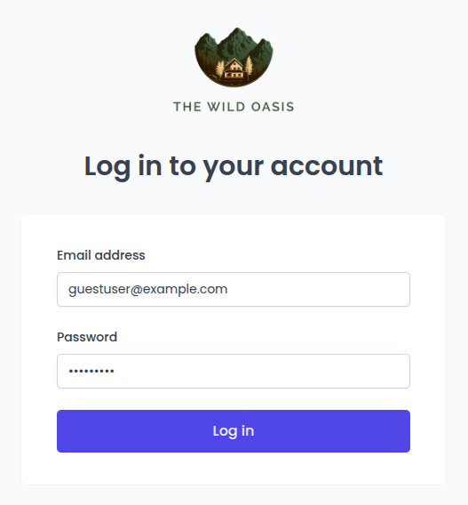
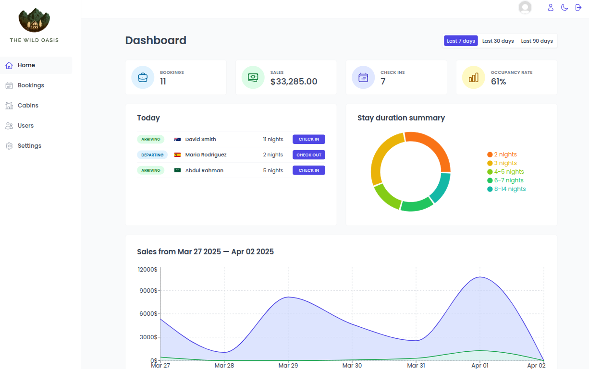
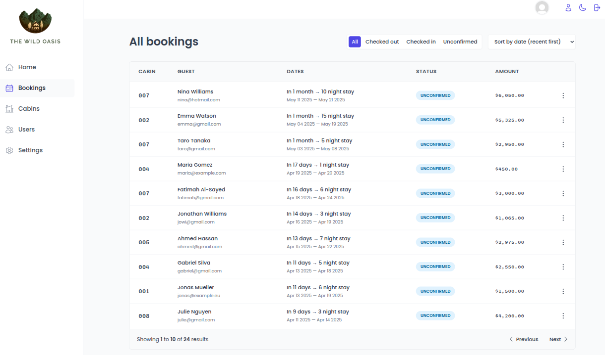
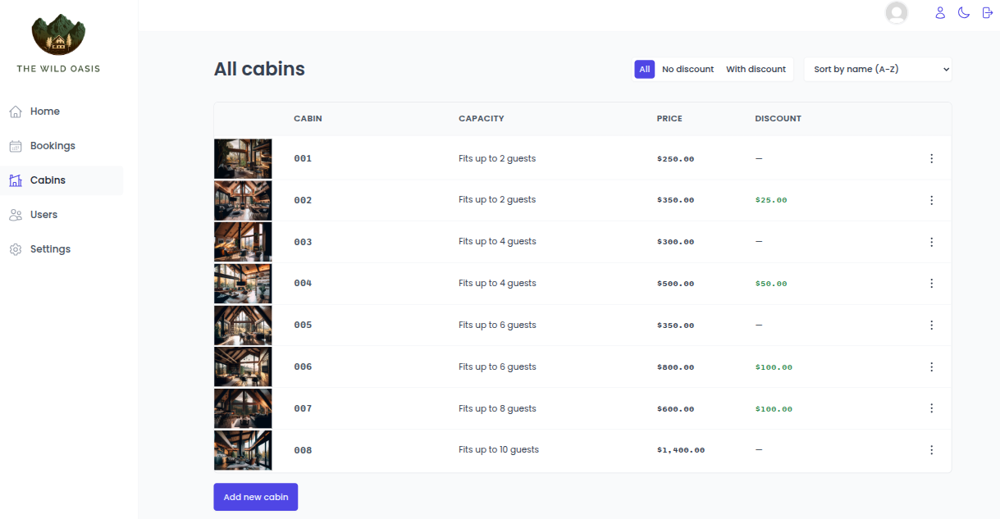
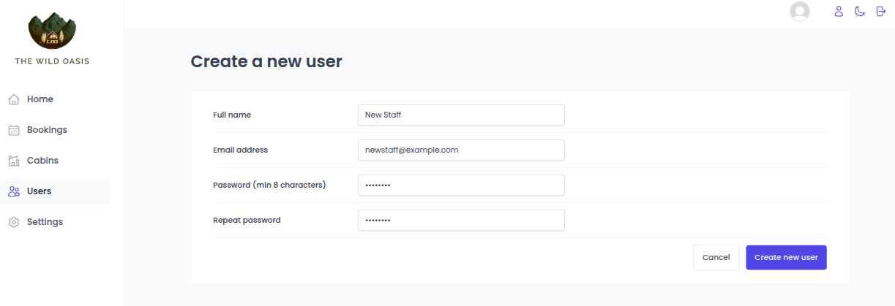
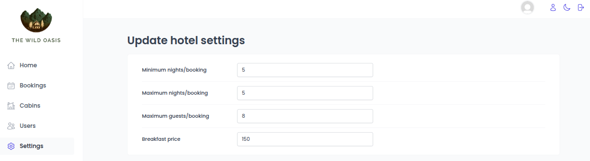
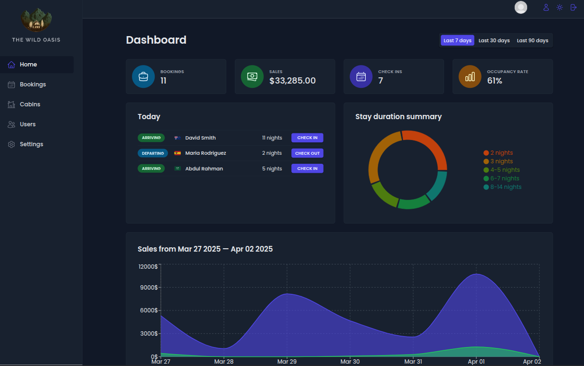

<p align=center>
<a target="_blank" style="text-decoration: none" href="https://oasiscabins.vercel.app">
    
</a>
    <br/>
    <br/>
   
</p>
<br/>
<hr/>
<br/>
A <a target="_blank" href="https://oasiscabins.vercel.app/">web application</a> for hotel management. Lets the staff manage bookings, cabins and analyse general statistics 🏨

## 📸 Screenshots

### Login



### Dashboard



### Bookings



### Cabins



### New staff account creation



### Settings



### Dark mode



## 🧑‍💻 Technology Stack

<a target="_blank" style="text-decoration: none" href="https://react.dev">
  
</a>&nbsp;&nbsp;
<a target="_blank" style="text-decoration: none" href="https://tanstack.com/query/latest">
  
</a>&nbsp;&nbsp;
<a target="_blank" style="text-decoration: none" href="https://react-hook-form.com">
  
</a>&nbsp;&nbsp;
<a target="_blank" style="text-decoration: none" href="https://developer.mozilla.org/en-US/docs/Web/HTML">
  
</a>

## Backend

- To store data and user authentication:

  <a target="_blank" style="text-decoration: none" href="https://supabase.com">
  
  </a>

## 🔧 Prerequisites

- > [node](https://nodejs.org/en/) >= v22.4.1
- > [npm](https://www.npmjs.com/) >= v10.8.1

## ⚙ Installation

1. Clone / Download [this](https://github.com/Pranav-Patani/wildoasis) repo.
2. Inside the project, open a terminal and run:

   ```
   npm install
   ```

   This will install all the dependencies.

3. Create your supabase account and find your supabase URL and supabase Key.

4. Find the services directory under the src directory and open the supabase.js file. Update it with your own URL and key.

   ```
   const supabaseUrl = yourSupabaseUrl
   const supabaseKey = yourSupabaseKey
   ```

   Replace _yourSupabaseUrl_ and _yourSupabaseKey_ with your own **Supabase URL** and **API Key**.

5. Go to supabase and create 4 tables - cabins, bookings, guests and settings. Create new policies, Insert, Delete, Update, Select, with user authentication for all of them.

6. Create storage buckets for storing cabin images (named cabins) and user avatars (named avatars) in supabase.

7. Manually create a user from supabse. Further can be created via the app through this user's account.

8. To start the development server run:
   ```
   npm run dev
   ```

## 🧑‍💼 Author

<a target="_blank" style="text-decoration: none" href="https://x.com/Prnv_Ptn">

</a>
<br/>
<a target="_blank" style="text-decoration: none" href="https://www.linkedin.com/in/pranavpatani/">
    
</a>
